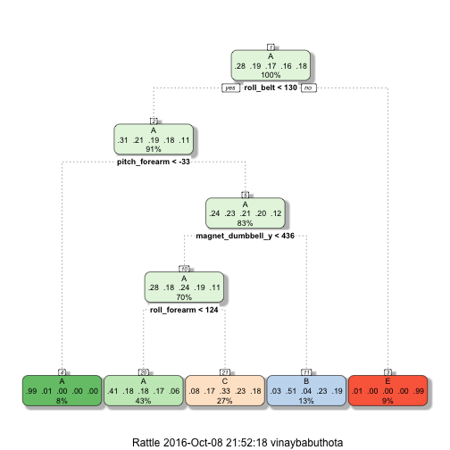

<!-- rmarkdown v1 -->


## Practical Machine Learning Project -Prediction 
### Executive Summary
Using devices such as Jawbone Up, Nike FuelBand, and Fitbit it is now possible to collect a large amount of data about personal activity relatively inexpensively. These type of devices are part of the quantified self movement – a group of enthusiasts who take measurements about themselves regularly to improve their health, to find patterns in their behavior, or because they are tech geeks. One thing that people regularly do is quantify how much of a particular activity they do, but they rarely quantify how well they do it. 

They were asked to perform barbell lifts correctly and incorrectly in 5 different ways.

In this project, our goal will be to use data from accelerometers on the belt, forearm, arm, and dumbell of 6 participants.
The main goal of your project is to predict the manner in which they did the exercise.

The training data for this project are available at:

https://d396qusza40orc.cloudfront.net/predmachlearn/pml-training.csv

The test data are available at:

https://d396qusza40orc.cloudfront.net/predmachlearn/pml-testing.csv

We will use the "classe" variable in the training set for prediction.

We will  create a report describing how we built your model, how we used cross validation, what we think the expected out of sample error is, and why we made the choices we did.

## Exploratory Data Analysis


```r
training <- read.csv("pml-training.csv", na.strings = c("NA", ""))
testing <- read.csv("pml-testing.csv", na.strings = c("NA", ""))
```

We now delete columns (predictors) of the training and testing set that contain any missing values.Then remove the first seven predictors since these variables have little predicting power for the outcome classe.


```r
training <- training[, colSums(is.na(training)) == 0]
testing <- testing[, colSums(is.na(testing)) == 0]
trainData <- training[, -c(1:7)]
testData <- testing[, -c(1:7)]
dim(trainData)
```

```
## [1] 19622    53
```

```r
dim(testData)
```

```
## [1] 20 53
```

The cleaned data sets trainData and testData both have 53 columns with the same first 52 variables and the last variable classe and problem_id respectively. trainData has 19622 rows while testData has 20 rows.

We will use the training dataset for building the model
## Data Splitting

In order to get out-of-sample errors, we split the cleaned training set trainData into a training set (train, 70%) for prediction and a validation set (valid 30%) to compute the out-of-sample errors.


```r
set.seed(1234) 
inTrain <- createDataPartition(trainData$classe, p = 0.7, list = FALSE)
train <- trainData[inTrain, ]
valid <- trainData[-inTrain, ]
```

## Prediction Algorithms

### Classification trees

In practice, k=5k=5 or k=10k=10 when doing k-fold cross validation. Here we consider 5-fold cross validation (default setting in trainControl function is 10) when implementing the algorithm to save a little computing time. Since data transformations may be less important in non-linear models like classification trees, we do not transform any variables.


```r
control <- trainControl(method = "cv", number = 3)
fit_rpart <- train(classe ~ ., data = train, method = "rpart",trControl = control)
print(fit_rpart, digits = 4)
```

```
## CART 
## 
## 13737 samples
##    52 predictor
##     5 classes: 'A', 'B', 'C', 'D', 'E' 
## 
## No pre-processing
## Resampling: Cross-Validated (3 fold) 
## Summary of sample sizes: 9157, 9157, 9160 
## Resampling results across tuning parameters:
## 
##   cp       Accuracy  Kappa  
##   0.03550  0.5358    0.40772
##   0.06093  0.3683    0.12785
##   0.11738  0.3116    0.04139
## 
## Accuracy was used to select the optimal model using  the largest value.
## The final value used for the model was cp = 0.0355.
```

```r
fancyRpartPlot(fit_rpart$finalModel)
```



# Predicting outcomes using validation set and Showing  Prediction result


```r
predict_rpart <- predict(fit_rpart, valid)
conf_rpart <- confusionMatrix(valid$classe, predict_rpart)
conf_rpart
```

```
## Confusion Matrix and Statistics
## 
##           Reference
## Prediction    A    B    C    D    E
##          A 1530   35  105    0    4
##          B  486  379  274    0    0
##          C  493   31  502    0    0
##          D  452  164  348    0    0
##          E  168  145  302    0  467
## 
## Overall Statistics
##                                           
##                Accuracy : 0.489           
##                  95% CI : (0.4762, 0.5019)
##     No Information Rate : 0.5317          
##     P-Value [Acc > NIR] : 1               
##                                           
##                   Kappa : 0.3311          
##  Mcnemar's Test P-Value : NA              
## 
## Statistics by Class:
## 
##                      Class: A Class: B Class: C Class: D Class: E
## Sensitivity            0.4890   0.5027   0.3279       NA  0.99151
## Specificity            0.9478   0.8519   0.8797   0.8362  0.88641
## Pos Pred Value         0.9140   0.3327   0.4893       NA  0.43161
## Neg Pred Value         0.6203   0.9210   0.7882       NA  0.99917
## Prevalence             0.5317   0.1281   0.2602   0.0000  0.08003
## Detection Rate         0.2600   0.0644   0.0853   0.0000  0.07935
## Detection Prevalence   0.2845   0.1935   0.1743   0.1638  0.18386
## Balanced Accuracy      0.7184   0.6773   0.6038       NA  0.93896
```

```r
accuracy_rpart <- conf_rpart$overall[1]
accuracy_rpart
```

```
##  Accuracy 
## 0.4890399
```

From the confusion matrix, the accuracy rate is 0.489, and so the out-of-sample error rate is 0.355. Using classification tree does not predict the outcome classe very well.

## Random forests

Since classification tree method does not perform well, we try random forest method instead.


```r
fit_rf <- train(classe ~ ., data = train, method = "parRF", ntree = 250,
                   trControl = control)
```

```
## Loading required package: e1071
```

```
## Loading required package: foreach
```

```
## Warning: executing %dopar% sequentially: no parallel backend registered
```

```r
print(fit_rf, digits = 4)
```

```
## Parallel Random Forest 
## 
## 13737 samples
##    52 predictor
##     5 classes: 'A', 'B', 'C', 'D', 'E' 
## 
## No pre-processing
## Resampling: Cross-Validated (3 fold) 
## Summary of sample sizes: 9159, 9157, 9158 
## Resampling results across tuning parameters:
## 
##   mtry  Accuracy  Kappa 
##    2    0.9879    0.9847
##   27    0.9889    0.9859
##   52    0.9854    0.9816
## 
## Accuracy was used to select the optimal model using  the largest value.
## The final value used for the model was mtry = 27.
```

# Predicting outcomes using validation set and showing  prediction result


```r
predict_rf <- predict(fit_rf, valid)

(conf_rf <- confusionMatrix(valid$classe, predict_rf))
```

```
## Confusion Matrix and Statistics
## 
##           Reference
## Prediction    A    B    C    D    E
##          A 1674    0    0    0    0
##          B   10 1128    1    0    0
##          C    0    4 1018    4    0
##          D    0    1    6  955    2
##          E    0    0    2    4 1076
## 
## Overall Statistics
##                                          
##                Accuracy : 0.9942         
##                  95% CI : (0.9919, 0.996)
##     No Information Rate : 0.2862         
##     P-Value [Acc > NIR] : < 2.2e-16      
##                                          
##                   Kappa : 0.9927         
##  Mcnemar's Test P-Value : NA             
## 
## Statistics by Class:
## 
##                      Class: A Class: B Class: C Class: D Class: E
## Sensitivity            0.9941   0.9956   0.9912   0.9917   0.9981
## Specificity            1.0000   0.9977   0.9984   0.9982   0.9988
## Pos Pred Value         1.0000   0.9903   0.9922   0.9907   0.9945
## Neg Pred Value         0.9976   0.9989   0.9981   0.9984   0.9996
## Prevalence             0.2862   0.1925   0.1745   0.1636   0.1832
## Detection Rate         0.2845   0.1917   0.1730   0.1623   0.1828
## Detection Prevalence   0.2845   0.1935   0.1743   0.1638   0.1839
## Balanced Accuracy      0.9970   0.9966   0.9948   0.9949   0.9984
```

```r
(accuracy_rf <- conf_rf$overall[1])
```

```
##  Accuracy 
## 0.9942226
```

For this dataset, random forest method is way better than classification tree method. The accuracy rate is 0.994

# Prediction on Testing Set
We now use random forests to predict the outcome variable classe for the testing set.


```r
(predict(fit_rf, testData))
```

```
##  [1] B A B A A E D B A A B C B A E E A B B B
## Levels: A B C D E
```
